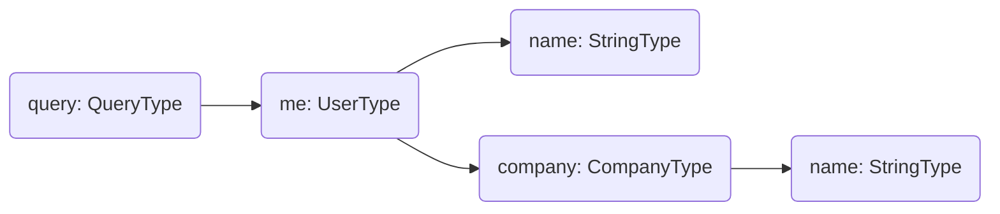

import { ExampleTabs } from "../../../components/mdx/example-tabs"

When it comes to fetching data in a GraphQL server, it will always come down to a resolver.

**A resolver is a generic function that fetches data from an arbitrary data source for a particular field.**

Which means every field in your graph is associated with a specific resolver function to fetch or select its data.
Even if there isn't a resolver defined for one field, Hot Chocolate will create a default resolver for this particular field behind the scenes.

In Hot Chocolate, a default resolver is a compiled function for a specific field that accesses a property of its parent value, which matches the field name.

<!-- todo: maybe move the part about default (property) resolvers down to defining a resolver -->

## Resolver Tree

A resolver tree is a projection of a GraphQL operation that is prepared for execution.

For better understanding, let's imagine we have a simple GraphQL query like the following, where we select some fields of the currently logged-in user.

```graphql
query {
  me {
    name
    company {
      name
    }
  }
}
```

In Hot Chocolate, this query results in the following resolver tree.



A resolver tree in the end is nothing else than a resolver chain where each branch can be executed in parallel.

The execution engine will start traversing this tree from top to bottom, starting with one or more root resolvers. In the case of the above example it will start at `me` and then follow along the paths.

The execution of a branch is finished, once a field returning a scalar value, like the `name` string, is reached. As soon as all branches have reached their end, the execution engine deems the operation finished and returns the result.

# Defining a Resolver

As previously mentioned a resolver at its core is just a function and that is also how they are mostly defined.

## Regular Resolver

<ExampleTabs>
<ExampleTabs.Annotation>

```csharp
public class Query
{
    public string Foo() => "Bar";
}

public class Startup
{
    public void ConfigureServices(IServiceCollection services)
    {
        services
            .AddGraphQLServer()
            .AddQueryType<Query>();
    }
}
```

</ExampleTabs.Annotation>
<ExampleTabs.Code>

```csharp
public class Query
{
    public string Foo() => "Bar";
}

public class QueryType: ObjectType<Query>
{
    protected override void Configure(IObjectTypeDescriptor<Query> descriptor)
    {
        descriptor
            .Field(f => f.Foo())
            .Type<NonNullType<StringType>>();
    }
}

public class Startup
{
    public void ConfigureServices(IServiceCollection services)
    {
        services
            .AddGraphQLServer()
            .AddQueryType<QueryType>();
    }
}
```

We can also provide a resolver delegate by using the `Resolve` method.

```csharp
descriptor
    .Field("foo")
    .Resolve(context =>
    {
        return "Bar";
    });
```

</ExampleTabs.Code>
<ExampleTabs.Schema>

```csharp
public class Query
{
    public string Foo() => "Bar";
}

public class Startup
{
    public void ConfigureServices(IServiceCollection services)
    {
        services
            .AddGraphQLServer()
            .AddDocumentFromString(@"
                type Query {
                    foo: String!
                }
            ")
            .BindComplexType<Query>();
    }
}
```

<!-- todo: resolver delegate -->

</ExampleTabs.Schema>
</ExampleTabs>

## Async Resolver

Most data fetching operations, like calling a service or communicating with a database, will be asynchronous. In Hot Chocolate we can simply mark our resolver methods and delegates as `async` and everything works out of the box.

<ExampleTabs>
<ExampleTabs.Annotation>

```csharp
public class Query
{
    public async Task<string> Foo()
    {
        await Task.Delay(3000);

        return "Bar";
    }
}
```

</ExampleTabs.Annotation>
<ExampleTabs.Code>

```csharp
public class Query
{
    public async Task<string> Foo()
    {
        await Task.Delay(3000);

        return "Bar";
    }
}

public class QueryType: ObjectType<Query>
{
    protected override void Configure(IObjectTypeDescriptor<Query> descriptor)
    {
        descriptor
            .Field(f => f.Foo())
            .Type<NonNullType<StringType>>();
    }
}
```

When using the `Resolve` method, we just have to mark the delegate as `async`.

```csharp
descriptor
    .Field("foo")
    .Resolve(async context =>
    {
        await Task.Delay(3000);

        return "Bar";
    });
```

</ExampleTabs.Code>
<ExampleTabs.Schema>

```csharp
public class Query
{
    public async Task<string> Foo()
    {
        await Task.Delay(3000);

        return "Bar";
    }
}

public class Startup
{
    public void ConfigureServices(IServiceCollection services)
    {
        services
            .AddGraphQLServer()
            .AddDocumentFromString(@"
                type Query {
                    foo: String!
                }
            ")
            .BindComplexType<Query>();
    }
}
```

<!-- todo: resolver delegate -->

</ExampleTabs.Schema>
</ExampleTabs>

We can also add a `CancellationToken` as argument to our resolver. Hot Chocolate will automatically cancel this token, if the request has been aborted.

```csharp
public class Query
{
    public async Task<string> Foo(CancellationToken ct)
    {
        // Omitted code for brevity
    }
}
```

When using the `Resolve` method in Code-first, the `CancellationToken` is passed as second argument to the delegate.

```csharp
descriptor
    .Field("foo")
    .Resolve((context, ct) =>
    {
        // Omitted code for brevity
    });
```

We can also access the `CancellationToken` through the `IResolverContext`.

```csharp
descriptor
    .Field("foo")
    .Resolve(context =>
    {
        CancellationToken ct = context.RequestAborted;

        // Omitted code for brevity
    });
```

## Constant Resolver

TODO

# Injecting Services

Resolvers integrate nicely with `Microsoft.Extensions.DependecyInjection`.
We can access all registered services in our resolvers.

Let's assume we have a `UserService` that we have registered as a service.

```csharp
public class UserService
{
    public List<User> GetUsers()
    {
        // Omitted code for brevity
    }
}

public class Startup
{
    public void ConfigureServices(IServiceCollection services)
    {
        services
            .AddSingleton<UserService>()
            .AddGraphQLServer()
            .AddQueryType<Query>();
    }
}
```

We can access the `UserService` in our resolvers like the following.

<ExampleTabs>
<ExampleTabs.Annotation>

```csharp
public class Query
{
    public List<User> GetUsers([Service] UserService userService)
    {
        return userService.GetUsers();
    }
}
```

</ExampleTabs.Annotation>
<ExampleTabs.Code>

```csharp
public class Query
{
    public List<User> GetUsers([Service] UserService userService)
    {
        return userService.GetUsers();
    }
}

public class QueryType: ObjectType<Query>
{
    protected override void Configure(IObjectTypeDescriptor<Query> descriptor)
    {
        descriptor
            .Field(f => f.Foo(default))
            .Type<ListType<UserType>>();
    }
}
```

When using the `Resolve` method, we can access services through the `IResolverContext`.

```csharp
descriptor
    .Field("foo")
    .Resolve(context =>
    {
        var userService = context.Service<UserService>();

        return userService.GetUsers();
    });
```

</ExampleTabs.Code>
<ExampleTabs.Schema>

```csharp
public class Query
{
    public List<User> GetUsers([Service] UserService userService)
    {
        return userService.GetUsers();
    }
}
```

<!-- todo: delegate and more info -->

</ExampleTabs.Schema>
</ExampleTabs>

# Accessing parent values

When selecting a field from a

<ExampleTabs>
<ExampleTabs.Annotation>

```csharp

```

</ExampleTabs.Annotation>
<ExampleTabs.Code>

```csharp

```

</ExampleTabs.Code>
<ExampleTabs.Schema>

```csharp

```

</ExampleTabs.Schema>
</ExampleTabs>

# Error Handling

TODO

# Context Data

TODO

<!-- todo: state as well? -->

# Accessing HttpContext

Like any other service we can inject the `IHttpContextAccessor` into our resolver. This is useful, if we for example need to set a header or cookie.

```csharp
public string Foo(string id, [Service] IHttpContextAccessor httpContextAccessor)
{
    if (httpContextAccessor.HttpContext != null)
    {
        // Omitted code for brevity
    }
}
```

Learn more about [injecting services into resolvers](#injecting-services).

<!-- Okay, let's dissect a little further here. A resolver chain always starts with one or many root resolver, which is in our case `me()` and then follows the path along. In this scenario, the next resolver would be `name()`, which is also the last resolver in our chain. As soon as `me` has fetched the user profile of the currently logged-in user, Hot Chocolate will immediately start executing the next resolver and feeding in the previous object value, also called a parent or parent value in spec language. Let's say the parent value looks like this.

```csharp
var parent = new User
{
  Id = "user-1",
  Name = "ChilliCream",
  ...
}
````

Then the `name()` resolver can just access the `Name` property of the parent value and simply return it. As soon as all resolvers have been completed, the execution engine would return the following GraphQL result, provided that everything went successful.

```json
{
  "data": {
    "me": {
      "name": "ChilliCream"
    }
  }
}
```

Excellent, now that we know what resolvers are and how they work in a bigger picture, how can we start writing one. Let's jump to the next section and find out.

# Defining a resolver

A resolver is a function that takes zero or many arguments and returns one value. The simplest resolver to write is a resolver that takes zero arguments and returns a simple value type (e.g., a string). For simplicity, we will do precisely that in our first example. Creating a resolver named `Say` with no arguments, which returns just a static string value `Hello World!`.

## Basic resolver example

<ExampleTabs>
<ExampleTabs.Annotation>

```csharp
// Query.cs
public class Query
{
    public string Say() => "Hello World!";
}

// Startup.cs
public class Startup
{
    public void ConfigureServices(IServiceCollection services)
    {
        services
            .AddGraphQLServer()
            .AddQueryType<Query>();
    }

    // Omitted code for brevity
}
```

</ExampleTabs.Annotation>
<ExampleTabs.Code>

```csharp
// Query.cs
public class Query
{
    public string Say() => "Hello World!";
}

// QueryType.cs
public class QueryType
    : ObjectType<Query>
{
    protected override void Configure(
        IObjectTypeDescriptor<Query> descriptor)
    {
        descriptor
            .Field(f => f.Say())
            .Type<NonNullType<StringType>>();
    }
}

// Startup.cs
public class Startup
{
    public void ConfigureServices(IServiceCollection services)
    {
        services
            .AddGraphQLServer()
            .AddQueryType<QueryType>();
    }

    // Omitted code for brevity
}
```

</ExampleTabs.Code>
<ExampleTabs.Schema>

```csharp
// Query.cs
public class Query
{
    public string Say() => "Hello World!";
}

// Startup.cs
public class Startup
{
    public void ConfigureServices(IServiceCollection services)
    {
        services
            .AddGraphQLServer()
            .AddDocumentFromString(@"
                type Query {
                    say: String!
                }
            ")
            .BindComplexType<Query>();
    }

    // Omitted code for brevity
}
```

</ExampleTabs.Schema>
</ExampleTabs>

When comparing all three approaches side-by-side, we can see very quickly that they all look nearly the same. They all have the `Query` type in common, which is identical in all three approaches. Regardless, the `Query` type contains a method named `Say`, which is our resolver, in fact, the most significant bit here. The `Say` method will be translated into the `say` field on the schema side as soon as Hot Chocolate is initialized. As a small side note here, all three approaches will result in the same `SDL`.

```sdl
type Query {
  say: String!
}
```

Let's get back to where the approaches differentiate—the `Startup` class, which contains the service configuration that slightly differs in each approach. In the **annotation-based** approach, we bind the `Query` type to the GraphQL schema. Easy, quick, and without writing any GraphQL specific binding code. Hot Chocolate will do the hard part and infer everything from the type itself. In the **code-first** approach, we bind a meta-type, the `QueryType` type, which contains the GraphQL configuration for the `Query` type, to the GraphQL schema. Instead of inferring the GraphQL type, Hot Chocolate will take our specific GraphQL configuration and creates the GraphQL schema out of it. In the **schema-first** approach, we provide Hot Chocolate the `SDL` directly, and Hot Chocolate will match that to our resolver. Now that we know how to define a resolver in all three approaches, it's time to learn how to pass arguments into a resolver. Let's head to the next section.

# Resolver Arguments

A resolver argument, not to be confused with a field argument in GraphQL, can be a field argument value, a DataLoader, a DI service, state, or even context like a parent value. We will go through a couple of examples where we see all types of resolver argument in action. For that, we will use the annotation-based approach because it makes no difference.

## Field argument example

```csharp
// Query.cs
public class Query
{
    public string Say(string name) => $"Hello {name}!";
}

// Startup.cs
public class Startup
{
    public void ConfigureServices(IServiceCollection services)
    {
        services
            .AddGraphQLServer()
            .AddQueryType<Query>();
    }

    // Omitted code for brevity
}
```

```sdl
type Query {
  say(name: String!): String!
}
```

## DataLoader argument example

```csharp
// Query.cs
public class Query
{
    public Task<Person> GetPerson(int id, MyDataLoader dataLoader) => dataLoader.LoadAsync(id);
}

// Person.cs
public record Person(string name);

// MyDataLoader.cs
public class MyDataLoader
    : DataLoaderBase<int, Person>
{
    public MyDataLoader(IBatchScheduler scheduler)
        : base(scheduler)
    { }

    protected override ValueTask<IReadOnlyList<Result<Person>>> FetchAsync(
        IReadOnlyList<int> keys,
        CancellationToken cancellationToken)
    {
        // Omitted code for brevity
    }
}

// Startup.cs
public class Startup
{
    public void ConfigureServices(IServiceCollection services)
    {
        services
            .AddGraphQLServer()
            .AddQueryType<Query>()
            .AddDataLoader<MyDataLoader>();
    }

    // Omitted code for brevity
}
```

```sdl
type Query {
  person(id: Int!): Person!
}

type Person {
  name: String!
}
```

# Naming Rules

- How should we name things
- How is a method name translated

# Best Practices

# Resolver Pipeline

# Error Handling

-->
